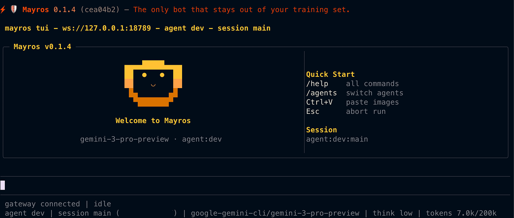

# ⚡🛡️ Mayros

<p align="center">
    
</p>

<p align="center">
  <strong>AI agent framework · Coding CLI · Personal assistant</strong><br>
  <em>One platform. Your terminal, your channels, your devices.</em>
</p>

<p align="center">
  <a href="https://github.com/ApiliumCode/mayros/actions/workflows/ci.yml?branch=main"></a>
  <a href="https://www.npmjs.com/package/@apilium/mayros"></a>
  <a href="https://github.com/ApiliumCode/mayros/releases"></a>
  <a href="https://discord.com/channels/1476351587105636404"></a>
  <a href="LICENSE"></a>
</p>

<p align="center">
  <a href="https://www.npmjs.com/package/@apilium/mayros"></a>
  = 22.12.0">
  
  
  
  
  
</p>

<p align="center">
  <a href="https://apilium.com/en/products/mayros">Product</a> · <a href="https://mayros.apilium.com">Download</a> · <a href="https://apilium.com/en/doc/mayros">Docs</a> · <a href="https://apilium.com/en/doc/mayros/start/getting-started">Getting Started</a> · <a href="VISION.md">Vision</a> · <a href="https://discord.com/channels/1476351587105636404">Discord</a>
</p>

---

**Mayros** is an open-source AI agent framework that runs on your own devices. It ships with an interactive **coding CLI** (`mayros code`), connects to **17+ messaging channels** (WhatsApp, Telegram, Slack, Discord, Signal, iMessage, Teams, and more), speaks and listens on **macOS/iOS/Android**, and has a **knowledge graph** that remembers everything across sessions. **Kaneru** — the multi-agent venture system — lets you build AI companies that learn, remember, and improve over time. All backed by a local-first Gateway and a 20-layer security architecture.

> **55+ extensions · 12,400+ tests · 29 hooks · MCP server & client · Multi-model · Multi-agent · Kaneru ventures**

```bash
npm install -g @apilium/mayros@latest
mayros onboard
mayros code   # interactive coding CLI
```

---

## Why Mayros?

|                        | Mayros                                                                                               | Others                    |
| ---------------------- | ---------------------------------------------------------------------------------------------------- | ------------------------- |
| 🧠 **Knowledge Graph** | AIngle Cortex — persistent memory across sessions, projects, and agents                              | Flat conversation history |
| 🤖 **Multi-Agent**     | Teams, workflows, mailbox, background tasks, git worktree isolation                                  | Single agent              |
| 📱 **Multi-Channel**   | 17 channels — WhatsApp, Telegram, Slack, Discord, Signal, iMessage, Teams, Matrix, WebChat, and more | Terminal only             |
| 🔒 **Security**        | 20 layers — WASM sandbox, bash scanner, interactive permissions, namespace isolation, rate limiter   | Basic sandboxing          |
| 🎙️ **Voice**           | Always-on Voice Wake + Talk Mode on macOS, iOS, Android                                              | None                      |
| 🖥️ **IDE**             | VSCode + JetBrains plugins with chat, plan, traces, KG                                               | VSCode only               |
| 📊 **Observability**   | Full trace system, decision graph, session fork/rewind                                               | Basic logging             |
| 🔌 **Extensions**      | 55+ plugin extensions, 29 hook types, MCP server + client (4 transports)                             | Limited plugins           |
| 🏢 **Kaneru**          | AI ventures with missions, squads, Q-learning routing, decision audit, fuel control                  | No organizational layer   |
| 🗺️ **Plan Mode**       | Cortex-backed semantic planning: explore → assert → approve → execute                                | Simple plan files         |

---

## Install

Runtime: **Node ≥ 22**. Works with npm, pnpm, or bun.

```bash
npm install -g @apilium/mayros@latest
# or: pnpm add -g @apilium/mayros@latest

mayros onboard --install-daemon
```

The wizard sets up the Gateway, workspace, channels, and skills. It installs the Gateway as a background daemon (launchd/systemd) so it stays running.

The installer automatically downloads [AIngle Cortex](https://github.com/ApiliumCode/aingle) (the semantic memory sidecar). No separate install needed.

New install? Start here: **[Getting Started](https://apilium.com/en/doc/mayros/start/getting-started)** · Upgrading? **[Updating guide](https://apilium.com/en/doc/mayros/install/updating)** (and run `mayros doctor`)

### Update

```bash
mayros update          # updates Mayros + Cortex automatically
# or: npm install -g @apilium/mayros@latest
```

### Uninstall

```bash
mayros uninstall           # interactive — choose what to remove
mayros uninstall --all     # remove everything (service, state, workspace, cortex)
mayros uninstall --dry-run # preview without deleting
```

A detailed data loss warning is always shown before deletion — listing every category of data (knowledge graph, ventures, agent memory, decision history, etc.).

### Desktop Installers

Zero-setup installers that bundle Node.js + AIngle Cortex — no prerequisites required.

| Platform                  | Format               | Download                                                   |
| ------------------------- | -------------------- | ---------------------------------------------------------- |
| **Windows**               | `.exe` (NSIS)        | [Releases](https://github.com/ApiliumCode/mayros/releases) |
| **macOS (Apple Silicon)** | `.dmg`               | [Releases](https://github.com/ApiliumCode/mayros/releases) |
| **macOS (Intel)**         | `.dmg`               | [Releases](https://github.com/ApiliumCode/mayros/releases) |
| **Linux (x64)**           | `.AppImage` / `.deb` | [Releases](https://github.com/ApiliumCode/mayros/releases) |
| **Linux (arm64)**         | `.AppImage` / `.deb` | [Releases](https://github.com/ApiliumCode/mayros/releases) |

Each installer includes Node.js portable + AIngle Cortex binary, runs `npm install` at install time, creates desktop shortcuts, and adds Mayros to the system PATH.

---

## Local Models

Run models locally with automatic GPU detection and guided setup. Mayros detects your hardware and recommends compatible models.

**Supported runtimes:**

| Runtime        | Use case                                        |
| -------------- | ----------------------------------------------- |
| **Ollama**     | Easiest setup — one command install             |
| **vLLM**       | High-throughput serving with tensor parallelism |
| **NVIDIA NIM** | Optimized containers for NVIDIA GPUs            |

**GPU detection:** NVIDIA (nvidia-smi), AMD/Intel (PowerShell on Windows, lspci on Linux), Apple Silicon (sysctl), Intel Mac (system_profiler), Raspberry Pi (BCM2 chipset).

**50+ model catalog** segmented by 8 activities (coding, chat, reasoning, creative, analysis, multilingual, vision, agents) with VRAM-aware filtering — from CPU-only models (0 VRAM) to 80GB+ enterprise models.

```bash
mayros mamoru model detect     # detect GPU and recommend models
mayros mamoru model catalog    # browse full catalog by activity
mayros mamoru model install    # guided installation
```

The onboarding wizard in the web portal also includes GPU-aware model selection with compatibility indicators.

---

## Coding CLI

`mayros code` is an interactive terminal UI for coding, conversation, and agent-driven workflows.

<p align="center">
  
</p>

```bash
mayros code                    # interactive TUI session
mayros tui                     # alias
mayros -p "refactor auth flow" # headless mode (non-interactive)
```

**Features:**

- 🎨 3 themes (dark, light, high-contrast) — `/theme`
- 📝 3 output styles (standard, explanatory, learning) — `/style`
- ⌨️ Vim mode with motions, operators, undo — `/vim`
- 📋 `Ctrl+V` image paste from clipboard
- 📊 `/diff` inline diff viewer · `/context` token usage chart
- 🗺️ `/plan` semantic plan mode (Cortex-backed)
- 📎 `/copy` to clipboard · `/export [file]` to disk
- 🔀 `/model` switch models · `/think` set thinking level · `/fast` toggle fast mode

**Slash commands (30+):**

| Command          | Description       | Command          | Description          |
| ---------------- | ----------------- | ---------------- | -------------------- |
| `/help`          | List all commands | `/plan`          | Semantic plan mode   |
| `/new`           | Reset session     | `/diff`          | Show pending changes |
| `/compact`       | Compact context   | `/context`       | Token usage chart    |
| `/think <level>` | Set thinking      | `/theme`         | Cycle themes         |
| `/model <name>`  | Switch model      | `/vim`           | Toggle vim mode      |
| `/permission`    | Permission mode   | `/copy`          | Copy last response   |
| `/fast`          | Fast mode         | `/export [file]` | Export session       |

**Markdown-driven extensibility:**

- Custom agents: `~/.mayros/agents/*.md` — define persona, tools, and behavior in markdown
- Custom commands: `~/.mayros/commands/*.md` — define slash commands as markdown templates

---

## Quick Start

```bash
# 1. Install and onboard
mayros onboard --install-daemon

# 2. Start the Gateway
mayros gateway --port 18789 --verbose

# 3. Code interactively
mayros code

# 4. Or use the agent directly
mayros agent --message "Ship checklist" --thinking high

# 5. Or send a message to any channel
mayros message send --to +1234567890 --message "Hello from Mayros"
```

Full beginner guide: **[Getting started](https://apilium.com/en/doc/mayros/start/getting-started)**

---

## Architecture

```
  WhatsApp · Telegram · Slack · Discord · Signal · iMessage · Teams · Matrix · WebChat
                                    │
                                    ▼
                    ┌───────────────────────────────┐
                    │          ⚡ Gateway             │
                    │     (local control plane)      │
                    │     ws://127.0.0.1:18789       │
                    └──────────────┬────────────────┘
                                   │
          ┌────────────┬───────────┼───────────┬────────────┐
          │            │           │           │            │
     mayros code   VSCode /   Pi Agent    macOS App    MCP Server
      (TUI)       JetBrains   (RPC)      (menu bar)   :19100
                                                     Claude Desktop
                                                     Claude Code
```

The Gateway is the single control plane — every client, channel, tool, and event connects through it.

---

## Multi-Channel Inbox

Mayros connects to the channels you already use. One assistant, everywhere.

| Channel                                                              | Transport  | Channel                                                                                                                   | Transport              |
| -------------------------------------------------------------------- | ---------- | ------------------------------------------------------------------------------------------------------------------------- | ---------------------- |
| [WhatsApp](https://apilium.com/en/doc/mayros/channels/whatsapp)      | Baileys    | [Microsoft Teams](https://apilium.com/en/doc/mayros/channels/msteams)                                                     | Bot Framework          |
| [Telegram](https://apilium.com/en/doc/mayros/channels/telegram)      | grammY     | [Matrix](https://apilium.com/en/doc/mayros/channels/matrix)                                                               | matrix-js-sdk          |
| [Slack](https://apilium.com/en/doc/mayros/channels/slack)            | Bolt       | [BlueBubbles](https://apilium.com/en/doc/mayros/channels/bluebubbles)                                                     | iMessage (recommended) |
| [Discord](https://apilium.com/en/doc/mayros/channels/discord)        | discord.js | [iMessage](https://apilium.com/en/doc/mayros/channels/imessage)                                                           | Legacy macOS           |
| [Google Chat](https://apilium.com/en/doc/mayros/channels/googlechat) | Chat API   | [Zalo](https://apilium.com/en/doc/mayros/channels/zalo) / [Personal](https://apilium.com/en/doc/mayros/channels/zalouser) | Extension              |
| [Signal](https://apilium.com/en/doc/mayros/channels/signal)          | signal-cli | [WebChat](https://apilium.com/en/doc/mayros/web/webchat)                                                                  | Gateway WS             |

**Security defaults:** DM pairing — unknown senders get a pairing code. You approve with `mayros pairing approve <channel> <code>`. Public DMs require explicit opt-in.

---

## Knowledge Graph (AIngle Cortex)

Mayros remembers. Not just conversation history — semantic knowledge stored as RDF triples in [AIngle Cortex](https://github.com/ApiliumCode/aingle).

**Three-tier memory:**

1. **MAYROS.md** — flat-file persona and instructions, always loaded into the system prompt
2. **AIngle Cortex** — RDF triple store (`subject → predicate → object`) scoped by namespace. Optional: falls back to file-based memory when unavailable
3. **Ineru STM/LTM** — short-term and long-term memory with temporal recall

**Built on top:**

- **Code indexer** — scans your codebase → RDF triples in Cortex (incremental, only re-indexes changed files)
- **Project memory** — persists conventions, findings, and architecture decisions across sessions
- **Smart compaction** — extracts key information before context pruning
- **Cross-session recall** — injects relevant knowledge from previous sessions into new prompts

**Design principles:** namespace isolation (no cross-namespace reads), graceful degradation (Cortex is a sidecar, not an FFI binding), circuit breaker with exponential backoff.

CLI: `mayros kg search|explore|query|stats|triples|namespaces|export|import`

---

## MCP Server

Mayros exposes its tools, resources, and prompts via the [Model Context Protocol](https://modelcontextprotocol.io). Any MCP client — Claude Desktop, Claude Code, VSCode, Cursor, JetBrains — can discover and use Mayros capabilities.

### Connect with Claude Desktop

```bash
# 1. Install Mayros
npm install -g @apilium/mayros@latest

# 2. Register with Claude Desktop (auto-detects paths, writes config)
mayros mcp-setup --desktop

# 3. Restart Claude Desktop — done
#    The tools icon appears in the chat input
```

Then in Claude Desktop, just talk naturally:

- _"Remember that our API uses JWT tokens with 24h expiry"_ → stores in semantic memory
- _"What do you know about our authentication?"_ → recalls from memory and knowledge graph
- _"Store in the graph: project:api depends_on express v5"_ → creates an RDF triple
- _"What's the memory status?"_ → shows STM/LTM/graph statistics

### Connect with Claude Code

```bash
# From your terminal (not inside a Claude Code session)
mayros mcp-setup
# or manually:
claude mcp add mayros -- mayros serve --stdio
```

### Connect with other MCP clients

```bash
# Start the HTTP server
mayros serve --http
# → MCP endpoint: http://127.0.0.1:19100/mcp
# → Legacy SSE:   http://127.0.0.1:19100/sse
# → Health check: http://127.0.0.1:19100/health
```

Point any MCP client to `http://127.0.0.1:19100/mcp` (Streamable HTTP) or `http://127.0.0.1:19100/sse` (legacy SSE for older clients).

### Bring persistent memory to any AI coding tool

AI coding CLIs have no memory between sessions. Mayros + [AIngle Cortex](https://github.com/ApiliumCode/aingle) fill that gap: semantic knowledge graph, DAG audit trail, vector search, and ZK proofs — all local-first.

Any MCP-compatible client gets instant access to 45+ tools via a single command:

```bash
claude mcp add mayros -- mayros serve --stdio   # Claude Code
# Gemini CLI, GitHub Copilot — coming soon
```

Built on the open [Model Context Protocol](https://modelcontextprotocol.io) standard — no vendor lock-in.

### Tools

| Tool                      | Description                                            |
| ------------------------- | ------------------------------------------------------ |
| `mayros_remember`         | Store information in persistent semantic memory        |
| `mayros_recall`           | Search memory by text, tags, or type                   |
| `mayros_search`           | Vector similarity search over memory (HNSW)            |
| `mayros_forget`           | Delete a memory entry                                  |
| `mayros_memory_stats`     | STM/LTM/HNSW/graph statistics                          |
| `mayros_memory_conflicts` | Scan memory for contradictions and duplicates          |
| `mayros_memory_digest`    | Summary of stored memories, categories, and DAG status |
| `mayros_cortex_query`     | Query the knowledge graph by subject/predicate/object  |
| `mayros_cortex_store`     | Store RDF triples in the knowledge graph               |
| `mayros_budget`           | Check token usage and budget status                    |
| `mayros_policy_check`     | Evaluate actions against governance policies           |
| `mayros_dag_tips`         | Get the current DAG tip hashes (frontier)              |
| `mayros_dag_action`       | Submit a new action to the DAG                         |
| `mayros_dag_history`      | Query action history for a subject or triple           |
| `mayros_dag_chain`        | Trace the full chain of ancestors for an action        |
| `mayros_dag_stats`        | DAG statistics (action count, tip count)               |
| `mayros_dag_prune`        | Prune old DAG actions by policy                        |
| `mayros_dag_time_travel`  | View graph state at a specific DAG action              |
| `mayros_dag_diff`         | Compare graph state between two DAG actions            |
| `mayros_dag_export`       | Export DAG actions as JSON                             |
| `mayros_dag_verify`       | Verify Ed25519 signature of a DAG action               |

---

## Intelligent Routing

Adaptive routing that learns and improves over time.

- **Eruberu** (Q-Learning model routing) — learns optimal provider/model per task type, budget level, and time slot
- **Miteru** (task-to-agent routing) — learns which agent handles each task type best via EMA scoring
- **Hayameru** (code transforms) — deterministic WASM transforms that bypass the LLM for simple edits (var→const, remove console, sort imports). 0 tokens, sub-millisecond

CLI: `mayros routing status|strategy|reset`

---

## Multi-Agent Mesh

Agents that work together. Mayros supports coordinated multi-agent workflows with shared knowledge.

- **Team manager** — Cortex-backed lifecycle: create, assign roles, merge results, disband
- **Workflow orchestrator** — built-in workflows (code-review, research, refactor) + custom definitions
- **Kimeru consensus** — majority vote, weighted (EMA), LLM-arbitrated, Byzantine (PBFT with HMAC), Raft leader election
- **Agent mailbox** — persistent inter-agent messaging (send/inbox/outbox/archive)
- **Background task tracker** — long-running tasks with status and cancellation
- **Git worktree isolation** — each agent works in its own worktree to avoid conflicts
- **Session fork/rewind** — checkpoint-based exploration with rewind capability
- **Kakeru bridge** — dual-platform coordination (Claude + Codex CLI) with file lock coordination

CLI: `mayros workflow run|list` · `mayros dashboard team|summary|agent` · `mayros tasks list|status|cancel|summary` · `mayros mailbox list|read|send|archive|stats`

---

## Kaneru — AI Venture Management

Kaneru turns Mayros into a full AI venture platform. Create organizations of agents that learn, coordinate, and improve over time — all stored in Cortex, all DAG-auditable.

### Quick Start

```bash
# Install a pre-built venture template (security-audit, content-pipeline, devops-squad)
mayros kaneru dojo install --template security-audit --name "My Security Team"

# Or use the web portal Setup Wizard: open dashboard → Ventures → New Venture
mayros dashboard
```

### Ventures & Missions

```bash
mayros kaneru venture create --name "Acme" --prefix ACM --directive "Ship fast" --fuel-limit 10000
mayros kaneru mission create --venture <id> --title "Audit auth module" --priority critical
mayros kaneru mission claim --mission <id> --agent scanner --run run-001
mayros kaneru mission transition --mission <id> --status review --run run-001
mayros kaneru comment add --mission <id> --author scanner --content "SQL injection found"
```

### Agents That Learn

Agents build expertise profiles over time. Q-learning + EMA scoring routes missions to the best agent automatically.

```bash
mayros kaneru learn profile --agent scanner     # see agent expertise
mayros kaneru learn top --domain typescript --task-type security-scan  # best agents for a task
mayros kaneru route --mission "Fix SQL injection" --agents scanner,reviewer,fixer  # smart routing
```

### Cost Analytics & Fuel Control

```bash
mayros kaneru fuel summary --venture <id>           # spend overview
mayros kaneru fuel analytics --venture <id> --period weekly  # time-series + provider breakdown
mayros kaneru fuel forecast --venture <id>           # burn rate + days until exhausted
```

### Decision Audit

```bash
mayros kaneru consensus --squad <id> --question "Ship or block?"
mayros kaneru decisions list --venture <id>
mayros kaneru decisions explain --decision <id>     # full reasoning with votes
```

### Distributed Ventures (P2P)

```bash
mayros kaneru discover --venture <id>    # auto-discover peers via mDNS
mayros kaneru sync --venture <id>        # DAG-sync venture state with peers
```

### Web Portal

The portal at `http://localhost:18789` includes:

- **Ventures tab** — venture table, mission kanban, chain of command tree, fuel bars
- **Kaneru tab** — squads, Q-learning router, squad builder
- **Canvas tab** — A2UI surfaces (overview, missions, chain, fuel) — interactive, venture-aware
- **Setup Wizard** — 4-step guided venture creation (Venture → Agent → Mission → Launch)
- **Command Bar** (Ctrl+/) — Spotlight-style overlay with venture context and voice input

### MCP Tools (24)

Any MCP client (Claude, Cursor, Cline) gets access to 24 Kaneru tools:

| Tool                                           | Purpose                     |
| ---------------------------------------------- | --------------------------- |
| `kaneru_venture_create/list`                   | Venture CRUD                |
| `kaneru_mission_create/claim/list/transition`  | Mission lifecycle           |
| `kaneru_fuel_summary/analytics/forecast`       | Cost control                |
| `kaneru_dojo_list/install`                     | Venture templates           |
| `kaneru_learn_profile/top`                     | Agent expertise             |
| `kaneru_decisions_list/explain`                | Decision audit              |
| `kaneru_sync/terminal_exec`                    | P2P sync + remote execution |
| `kaneru_squad_create/run/status`               | Multi-agent squads          |
| `kaneru_delegate/consensus/route/fuse/mailbox` | Coordination                |

CLI: `mayros kaneru` — 18 subcommand groups with 40+ commands total

---

## Mamoru — Security Layer

Mamoru (守る, "to protect") adds enterprise-grade security to Mayros:

- **Sandbox** — Landlock + seccomp probing for kernel-level agent isolation (Linux)
- **Eruberu Proxy** — All inference calls routed through the gateway with audit logging
- **Mamoru Gate** — Deny-by-default network egress with 12 presets and real-time approval
- **Secrets Vault** — AES-256-GCM encrypted secrets with scrypt key derivation
- **API Keys** — SHA-256 hashed agent keys with timing-safe validation
- **Local Models** — GPU detection + guided Ollama/vLLM setup

CLI: `mayros mamoru status|egress|proxy|keys|vault|model`

---

## IDE Plugins

Mayros lives inside your editor, connected via Gateway WebSocket.

**VSCode** (`tools/vscode-extension/`):

- Sidebar tree views: sessions, agents, skills
- Webview panels: chat, plan mode, trace viewer, knowledge graph
- Context menu actions and gutter markers

**JetBrains** (`tools/jetbrains-plugin/`):

- Unified tabbed panel with the same feature set
- Protocol v3 compatibility

Both connect to `ws://127.0.0.1:18789`.

---

## Voice & Companion Apps

- **[Voice Wake](https://apilium.com/en/doc/mayros/nodes/voicewake) + [Talk Mode](https://apilium.com/en/doc/mayros/nodes/talk)** — always-on speech for macOS/iOS/Android with ElevenLabs
- **[Live Canvas](https://apilium.com/en/doc/mayros/platforms/mac/canvas)** — agent-driven visual workspace with [A2UI](https://apilium.com/en/doc/mayros/platforms/mac/canvas#canvas-a2ui)
- **[macOS app](https://apilium.com/en/doc/mayros/platforms/macos)** — menu bar control, Voice Wake, Talk Mode overlay, WebChat, debug tools
- **[iOS node](https://apilium.com/en/doc/mayros/platforms/ios)** — Canvas, Voice Wake, Talk Mode, camera, screen recording, Bonjour pairing
- **[Android node](https://apilium.com/en/doc/mayros/platforms/android)** — Canvas, Talk Mode, camera, screen recording, optional SMS

---

## Extensions Ecosystem

55 extensions loaded as plugins at startup:

| Category      | Extension                 | Purpose                                                                   |
| ------------- | ------------------------- | ------------------------------------------------------------------------- |
| Skills        | `semantic-skills`         | QuickJS WASM sandbox, 6 semantic tools, skill marketplace                 |
| Agents        | `agent-mesh`              | Teams, workflows, consensus (majority/weighted/Byzantine/Raft), mailbox   |
| Ventures      | `kaneru`                  | Ventures, missions, projects, fuel, learning profiles, decision history   |
| Memory        | `memory-semantic`         | Cortex integration, rules engine, agent memory, contextual awareness      |
| Observability | `semantic-observability`  | Traces, decision graph, session fork/rewind                               |
| Indexer       | `code-indexer`            | Codebase scanning + RDF mapping (incremental)                             |
| Security      | `bash-sandbox`            | Command parsing, domain checker, blocklist, audit log                     |
| Governance    | `osameru-governance`      | Policy enforcement, HMAC audit trail, trust tiers                         |
| Permissions   | `interactive-permissions` | Runtime permission dialogs, intent classification, policy store           |
| Routing       | `eruberu`                 | Q-Learning model routing, budget-driven fallback, task classification     |
| Transforms    | `hayameru`                | Deterministic code transforms that bypass LLM (0 tokens, sub-ms)          |
| Rate Limit    | `tomeru-guard`            | Sliding window rate limiter, loop breaker, velocity circuit breaker       |
| Hooks         | `llm-hooks`               | Markdown-defined hook evaluation with safe condition parser               |
| MCP Server    | `mcp-server`              | 21 tools exposed via MCP (memory, graph, DAG, budget, governance)         |
| MCP Client    | `mcp-client`              | Model Context Protocol client (stdio, SSE, WebSocket, HTTP)               |
| Economy       | `token-economy`           | Budget tracking, response cache, prompt cache optimization                |
| Bridge        | `kakeru-bridge`           | Dual-platform coordination (Claude + Codex CLI)                           |
| Hub           | `skill-hub`               | Apilium Hub marketplace, Ed25519 signing, dependency audit                |
| IoT           | `iot-bridge`              | IoT node fleet management                                                 |
| Channels      | 17 plugins                | Discord, Telegram, WhatsApp, Slack, Signal, iMessage, Teams, Matrix, etc. |

---

## Hooks System

29 hook types across the assistant lifecycle:

- **Lifecycle** — `before_prompt_build`, `after_response`, `before_compaction`, `agent_end`, etc.
- **Security** — `permission_request` (modifying: allow/deny/ask), `config_change`
- **Coordination** — `teammate_idle`, `task_completed`, `notification`
- **HTTP webhooks** — POST delivery with HMAC-SHA256 signatures, retry + exponential backoff
- **Async queue** — background execution with concurrency limits and dead-letter queue
- **Markdown hooks** — place `.md` files in `~/.mayros/hooks/` for custom logic

---

## Security (20 layers)

Mayros takes security seriously. 20 layers of defense:

| Layer                       | Description                                                     |
| --------------------------- | --------------------------------------------------------------- |
| QuickJS WASM Sandbox        | Skills run in isolated WASM — no fs, net, process, eval         |
| Static Scanner              | 16 rules + anti-evasion preprocessing                           |
| Enrichment Sanitizer        | Unicode normalization, injection detection, depth limits        |
| Bash Sandbox                | Command parsing, domain blocklist, audit logging                |
| Interactive Permissions     | Runtime dialogs, intent classification, policy store            |
| Namespace Isolation         | All queries forced to `{ns}:` prefix — no cross-namespace reads |
| Tool Allowlist              | Intersection model — ALL active skills must allow a tool        |
| Rate Limiter                | Sliding window per skill (default: 60 calls/min)                |
| Query/Write Limits          | Per-skill caps on graph reads and writes                        |
| Enrichment Timeout          | 2s timeout prevents DoS via slow enrichment                     |
| Hot-Reload Validation       | Atomic swap, manifest validation, downgrade blocking            |
| Path Traversal Protection   | Reject `..` + `isPathInside()` double-check                     |
| Verify-then-Promote         | Temp extract → verify hashes → atomic promote                   |
| Circuit Breaker             | 3-state (closed/open/half-open) + exponential backoff           |
| DM Pairing                  | Unknown senders get pairing code, not access                    |
| Audit Logging               | Skill name + operation tagged on all sandbox writes             |
| Docker Sandboxing           | Per-session Docker containers for non-main sessions             |
| Governance (Osameru)        | Policy compilation, enforcement gates, HMAC audit trail         |
| Rate Limit (Tomeru)         | Sliding window, token bucket, loop breaking, velocity breaker   |
| Enterprise Managed Settings | Enforced config overrides with locked keys                      |

---

## Models

Mayros is multi-model. Bring any provider.

- Models config + CLI: **[Models](https://apilium.com/en/doc/mayros/concepts/models)**
- Auth profile rotation (OAuth vs API keys) + fallbacks: **[Model failover](https://apilium.com/en/doc/mayros/concepts/model-failover)**

Minimal config:

```json5
{
  agent: {
    model: "anthropic/claude-opus-4-6",
  },
}
```

Full reference: **[Configuration](https://apilium.com/en/doc/mayros/gateway/configuration)**

---

## Plan Mode

Cortex-backed semantic planning for complex multi-step tasks.

- **Explore** — gather context from the codebase and Cortex graph
- **Assert** — declare facts and constraints the plan must satisfy
- **Approve** — review the plan before execution
- **Execute** — run the approved plan with progress tracking

CLI: `mayros plan start|explore|assert|show|approve|execute|done|list|status` · TUI: `/plan`

---

## Remote Gateway

Run the Gateway on a small Linux instance. Clients connect over **Tailscale Serve/Funnel** or **SSH tunnels**, and device nodes (macOS/iOS/Android) handle local actions via `node.invoke`.

Tailscale modes: `off` (default) · `serve` (tailnet-only HTTPS) · `funnel` (public HTTPS, requires password auth).

Details: **[Remote access](https://apilium.com/en/doc/mayros/gateway/remote)** · **[Tailscale guide](https://apilium.com/en/doc/mayros/gateway/tailscale)** · **[Docker](https://apilium.com/en/doc/mayros/install/docker)**

---

## Chat Commands (Channels)

Send these in WhatsApp/Telegram/Slack/Discord/Google Chat/Microsoft Teams/WebChat:

| Command                       | Description                                            |
| ----------------------------- | ------------------------------------------------------ |
| `/status`                     | Session status (model, tokens, cost)                   |
| `/new`, `/reset`              | Reset the session                                      |
| `/compact`                    | Compact session context                                |
| `/think <level>`              | Set thinking level (off/minimal/low/medium/high/xhigh) |
| `/verbose on\|off`            | Toggle verbose mode                                    |
| `/usage off\|tokens\|full`    | Per-response usage footer                              |
| `/restart`                    | Restart the gateway (owner-only)                       |
| `/activation mention\|always` | Group activation (groups only)                         |

---

## From Source

```bash
git clone https://github.com/ApiliumCode/mayros.git
cd mayros

pnpm install
pnpm ui:build   # auto-installs UI deps on first run
pnpm build

pnpm mayros onboard --install-daemon

# Dev loop (auto-reload)
pnpm gateway:watch
```

`pnpm mayros ...` runs TypeScript directly (via `tsx`). `pnpm build` produces `dist/`.

**Development channels:**

- **stable** — tagged releases, npm dist-tag `latest`
- **beta** — prerelease tags, npm dist-tag `beta`
- **dev** — moving head of `main`, npm dist-tag `dev`

Switch: `mayros update --channel stable|beta|dev`. Details: **[Development channels](https://apilium.com/en/doc/mayros/install/development-channels)**

---

## Skills Hub

[Skills Hub](https://hub.apilium.com) is a skill marketplace. With it enabled, the agent can search for skills automatically and pull in new ones.

- Workspace root: `~/.mayros/workspace`
- Skills: `~/.mayros/workspace/skills/<skill>/SKILL.md`
- Injected prompt files: `AGENTS.md`, `SOUL.md`, `TOOLS.md`

---

## Channel Setup

<details>
<summary><strong>WhatsApp</strong></summary>

- Link the device: `pnpm mayros channels login` (stores creds in `~/.mayros/credentials`)
- Allowlist: `channels.whatsapp.allowFrom`
- Groups: `channels.whatsapp.groups` (include `"*"` to allow all)

[Full guide →](https://apilium.com/en/doc/mayros/channels/whatsapp)

</details>

<details>
<summary><strong>Telegram</strong></summary>

Set `TELEGRAM_BOT_TOKEN` or `channels.telegram.botToken`:

```json5
{ channels: { telegram: { botToken: "123456:ABCDEF" } } }
```

[Full guide →](https://apilium.com/en/doc/mayros/channels/telegram)

</details>

<details>
<summary><strong>Slack</strong></summary>

Set `SLACK_BOT_TOKEN` + `SLACK_APP_TOKEN` (or config equivalents).

[Full guide →](https://apilium.com/en/doc/mayros/channels/slack)

</details>

<details>
<summary><strong>Discord</strong></summary>

Set `DISCORD_BOT_TOKEN` or `channels.discord.token`:

```json5
{ channels: { discord: { token: "1234abcd" } } }
```

[Full guide →](https://apilium.com/en/doc/mayros/channels/discord)

</details>

<details>
<summary><strong>Signal · BlueBubbles · iMessage · Teams · Matrix · Zalo · WebChat</strong></summary>

- **Signal** — requires `signal-cli` + config section
- **BlueBubbles** (recommended iMessage) — `channels.bluebubbles.serverUrl` + `password` + webhook
- **iMessage** (legacy) — macOS-only via `imsg`
- **Microsoft Teams** — Bot Framework app + `msteams` config
- **Matrix** — `matrix-js-sdk` extension
- **Zalo / Zalo Personal** — extension channels
- **WebChat** — uses Gateway WebSocket directly

[Channel docs →](https://apilium.com/en/doc/mayros/channels)

</details>

---

## Documentation

**Start here:**

- [Getting started](https://apilium.com/en/doc/mayros/start/getting-started) — first-time setup
- [Architecture](https://apilium.com/en/doc/mayros/concepts/architecture) — gateway + protocol model
- [Configuration](https://apilium.com/en/doc/mayros/gateway/configuration) — every key + examples
- [Security](https://apilium.com/en/doc/mayros/gateway/security) — security model and guidance

**Platform guides:**

[macOS](https://apilium.com/en/doc/mayros/platforms/macos) · [iOS](https://apilium.com/en/doc/mayros/platforms/ios) · [Android](https://apilium.com/en/doc/mayros/platforms/android) · [Linux](https://apilium.com/en/doc/mayros/platforms/linux) · [Windows (WSL2)](https://apilium.com/en/doc/mayros/platforms/windows)

**Operations:**

[Gateway runbook](https://apilium.com/en/doc/mayros/gateway) · [Docker](https://apilium.com/en/doc/mayros/install/docker) · [Health checks](https://apilium.com/en/doc/mayros/gateway/health) · [Doctor](https://apilium.com/en/doc/mayros/gateway/doctor) · [Logging](https://apilium.com/en/doc/mayros/logging) · [Troubleshooting](https://apilium.com/en/doc/mayros/channels/troubleshooting)

**Deep dives:**

[Agent loop](https://apilium.com/en/doc/mayros/concepts/agent-loop) · [Sessions](https://apilium.com/en/doc/mayros/concepts/session) · [Models](https://apilium.com/en/doc/mayros/concepts/models) · [Presence](https://apilium.com/en/doc/mayros/concepts/presence) · [Streaming](https://apilium.com/en/doc/mayros/concepts/streaming) · [Skills](https://apilium.com/en/doc/mayros/tools/skills) · [Browser](https://apilium.com/en/doc/mayros/tools/browser) · [Canvas](https://apilium.com/en/doc/mayros/platforms/mac/canvas) · [Nodes](https://apilium.com/en/doc/mayros/nodes) · [Cron](https://apilium.com/en/doc/mayros/automation/cron-jobs) · [Webhooks](https://apilium.com/en/doc/mayros/automation/webhook) · [Gmail Pub/Sub](https://apilium.com/en/doc/mayros/automation/gmail-pubsub)

**Advanced:**

[Discovery + transports](https://apilium.com/en/doc/mayros/gateway/discovery) · [Bonjour/mDNS](https://apilium.com/en/doc/mayros/gateway/bonjour) · [Gateway pairing](https://apilium.com/en/doc/mayros/gateway/pairing) · [Tailscale](https://apilium.com/en/doc/mayros/gateway/tailscale) · [Remote gateway](https://apilium.com/en/doc/mayros/gateway/remote) · [Control UI](https://apilium.com/en/doc/mayros/web/control-ui) · [RPC adapters](https://apilium.com/en/doc/mayros/reference/rpc) · [TypeBox schemas](https://apilium.com/en/doc/mayros/concepts/typebox)

**Templates:**

[AGENTS](https://apilium.com/en/doc/mayros/reference/templates/AGENTS) · [BOOTSTRAP](https://apilium.com/en/doc/mayros/reference/templates/BOOTSTRAP) · [IDENTITY](https://apilium.com/en/doc/mayros/reference/templates/IDENTITY) · [TOOLS](https://apilium.com/en/doc/mayros/reference/templates/TOOLS) · [USER](https://apilium.com/en/doc/mayros/reference/templates/USER) · [Default AGENTS](https://apilium.com/en/doc/mayros/reference/AGENTS.default) · [Skills config](https://apilium.com/en/doc/mayros/tools/skills-config)

---

## Community

See [CONTRIBUTING.md](CONTRIBUTING.md) for guidelines, maintainers, and how to submit PRs.
AI/vibe-coded PRs welcome! 🤖

Special thanks to [Mario Zechner](https://mariozechner.at/) for his support and for
[pi-mono](https://github.com/badlogic/pi-mono).
